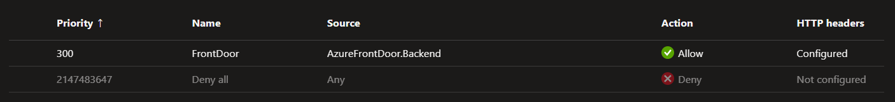

# Azure App Service Security

Implementation of Azure App Service security features.

Create the infrastructure:

```sh
terraform init
terraform apply -auto-approve
```

## Access Restriction

Controls inbound connectivity. Functionality available when Public Access is set to **TRUE**.

Access can be controlled to the main site and the SCM (Advanced). Advanced can inherit rules from main.

This Terraform configuration will set up automatically ALLOW for:

- Service Tag: `AzureFrontDoor.Backend`
- HTTP Header: `X-Azure-FDID`



Do set `Deny` as the unmatched rule:

```sh
az resource update --resource-group rg-bigfactory --name app-bigfactory --resource-type "Microsoft.Web/sites" \
    --set properties.siteConfig.ipSecurityRestrictionsDefaultAction=Deny
```

## VNET Integration

Only one VNET injection is supported.

## Service Endpoints

It is possible to use the Azure backbone to access an App Service from a VM or other services.

Enable service endpoints and check the hops.
